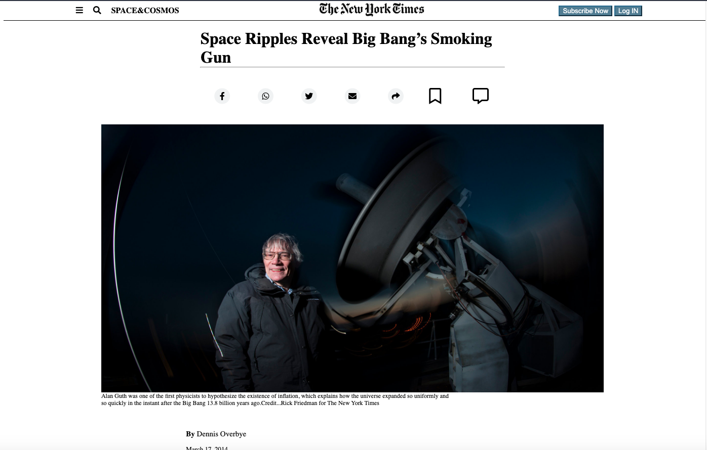

# PositioningandFloatingElements

> Cloning the NYT Article.

Cloning the Article from scratch using only HTML and CSS

## Built With

- HTML
- CSS

## Live Demo

[Live Demo Link](https://kiranitor123.github.io/PositioningandFloatingElements/)

## Getting Started

To get a local copy up and running follow these simple example steps.

### Prerequisites
Get a Computer with internet conexion
### Setup
Clone or zip the github proyect
### Install
Double click in the file index.html
### Run tests
run npm i // to get the dependences
run npx hint . //to run Webhint
run npx stylelint "**/*.{css,scss}" //to run Stylelint
### Deployment
SetUp the index, assets, and css in your web hosting and enjoy the page

## Author

👤 **@kiranitor123**

- GitHub: [@githubhandle](https://github.com/kiranitor123)
- LinkedIn: [LinkedIn](https://www.linkedin.com/in/rolando-diego-alvarez-faye-b2b34a1a9/)

## 🤝 Contributing

Contributions, issues, and feature requests are welcome!

Feel free to check the [issues page](issues/).

## Show your support

Give a ⭐️ if you like this project!
## 📝 License

This project is [MIT](lic.url) licensed.